<p align="center">
  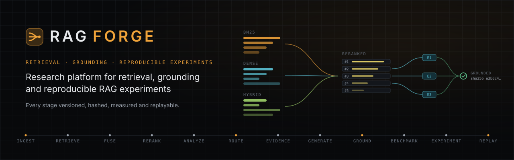
</p>

<p align="center">
  <a href="https://github.com/soyebmohammad03-dev/rag-forge/actions/workflows/ci.yml"></a>
  
  
  
  
  <a href="LICENSE"></a>
</p>

**RAG FORGE is a research platform for retrieval-augmented generation, not a chatbot.** It asks
one question: *can query characteristics choose a retrieval pipeline better than a fixed one?*
To answer it honestly it provides interchangeable retrieval components, an adaptive router whose
every decision is recorded, grounded generation whose every claim is checked against its
evidence, a controlled experiment engine with paired statistics, and replay: any recorded run can
be re-executed and compared stage by stage. Everything runs locally on a laptop CPU with pinned
open models; no API key is needed.

## Key capabilities

- **Versioned corpora**: TXT, Markdown and PDF ingestion; content-hashed documents and chunks; every
  corpus version stays readable.
- **Retrieval stack**: BM25 with version-scoped statistics, exact dense search
  (`bge-small-en-v1.5`), hybrid fusion (RRF or weighted), cross-encoder reranking
  (`ms-marco-MiniLM-L-6-v2`) with recorded rank movement.
- **Adaptive router**: a heuristic query analyzer and a rule policy choose strategy, fusion and
  reranking per query, with a full rule trace, margins and alternatives.
- **Evidence and grounding**: budgeted, diverse, version-pinned evidence; a versioned prompt
  contract; a local generator (`Qwen2.5-0.5B-Instruct`, 4-bit ONNX), an extractive baseline or any
  OpenAI-compatible endpoint; claims extracted and checked against the passages they cite.
- **Arena**: versioned benchmark datasets with optional annotations, a versioned metric registry
  (retrieval, reranking, grounding, automatic proxies, operational), hashed configuration
  snapshots, ablations with measured factors, partial failures kept, paired bootstrap statistics.
- **Reproducibility**: runs record commit, toolchain, lockfile hashes, settings (secrets redacted)
  and model file hashes; replay re-executes a run and reports `exact`, `equivalent`, `diverged` or
  `not_replayable` per case; manifests, Markdown research reports, JSON and CSV exports.

## Screenshots

All screenshots are of the running application with real data: the bundled development corpus
and a recorded 98-evaluation run.

| | |
|---|---|
| 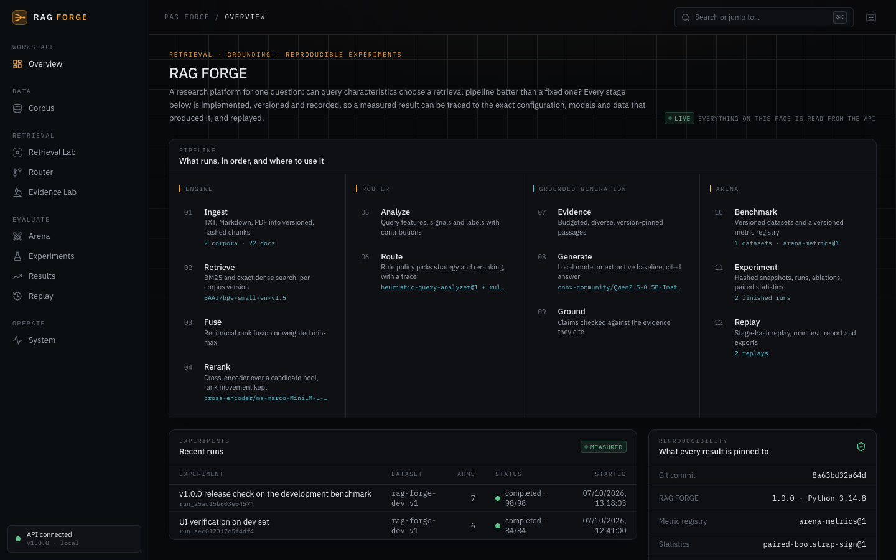 **Overview**: the implemented pipeline, each stage linked to where it is used, with live model, corpus, experiment and reproducibility state. | 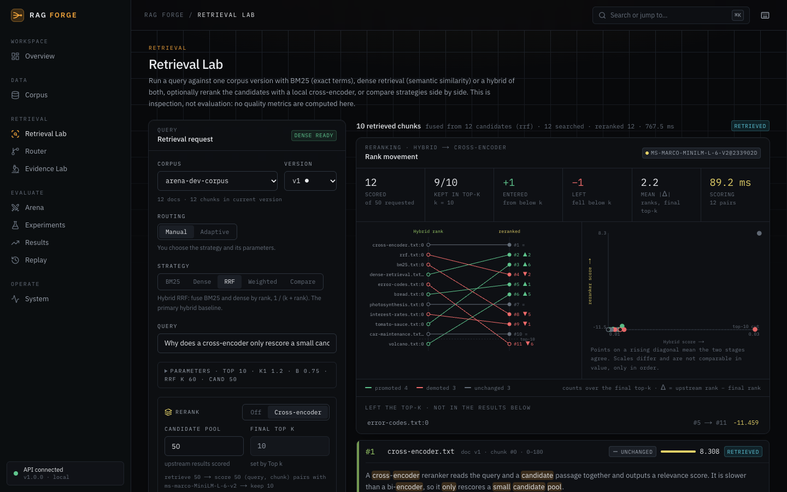 **Retrieval Lab**: hybrid RRF with cross-encoder reranking; how every candidate moved between the fused and the reranked ranking. |
| 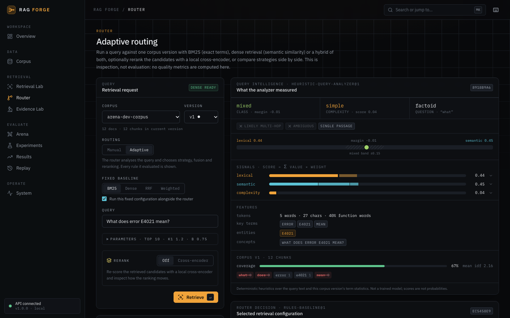 **Router**: query intelligence (class, complexity, lexical and semantic signals with contributions, corpus coverage) behind the routing decision. | 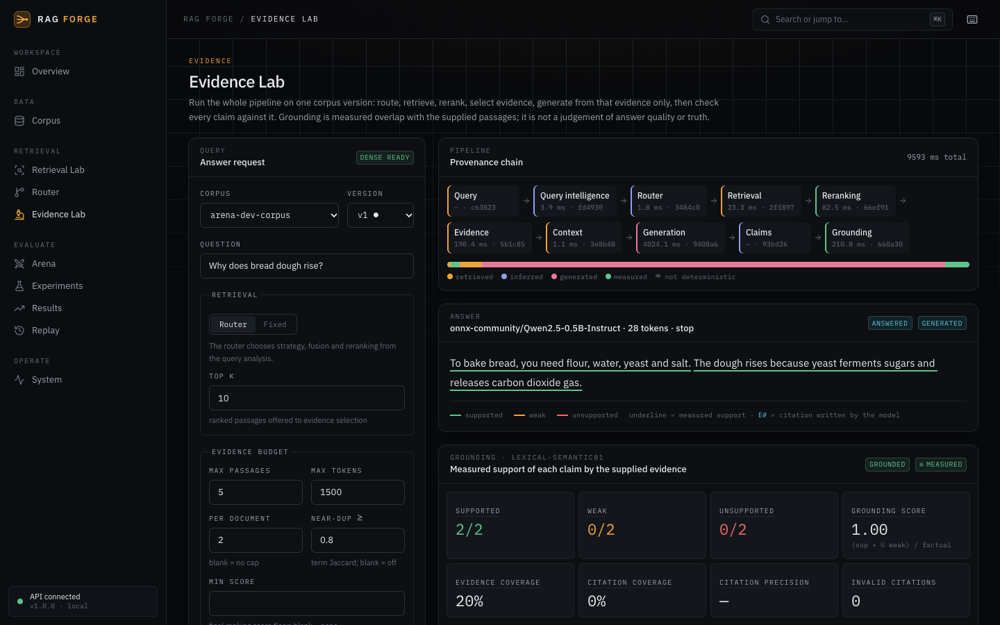 **Evidence Lab**: the provenance chain of a grounded answer from the local model, measured support per claim and grounding metrics. |
| 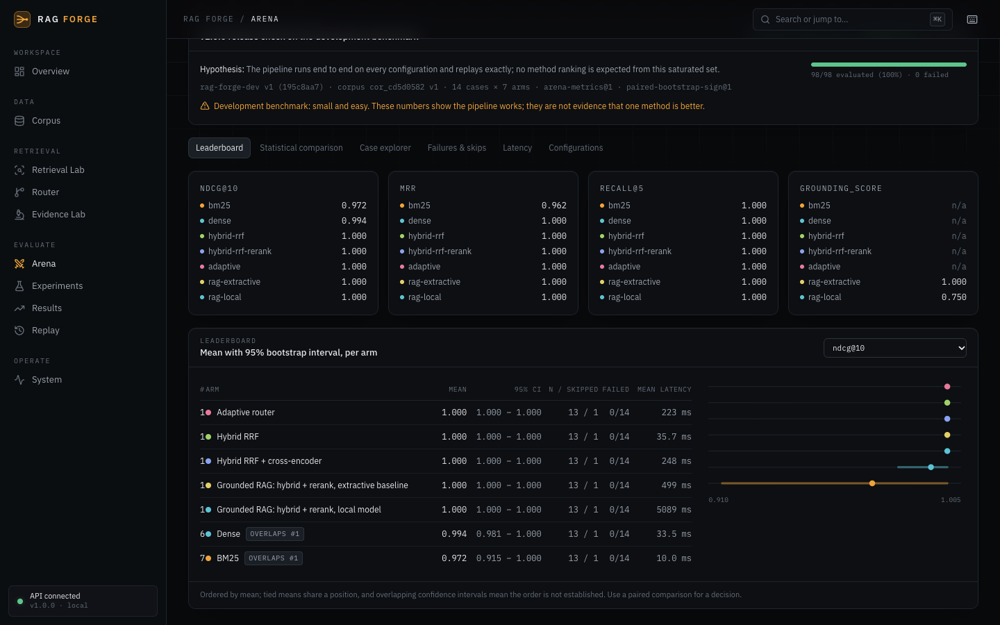 **Arena**: leaderboard with bootstrap intervals over seven configurations; overlapping intervals are flagged and ties share a position. | 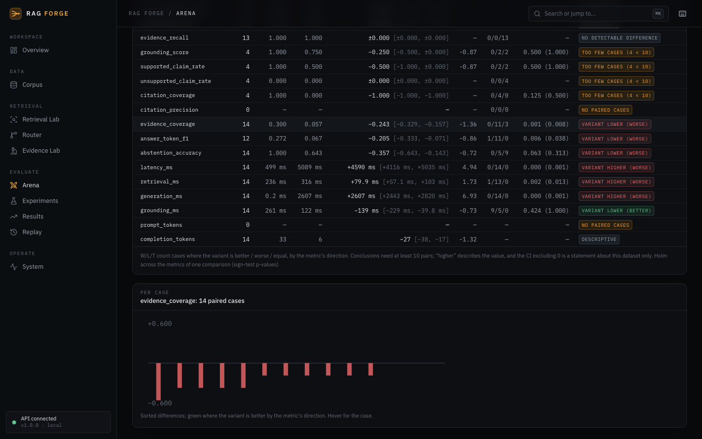 **Paired comparison**: per-metric differences with CIs, effect sizes, sign tests and Holm adjustment; conclusions only where the data support them. |
| 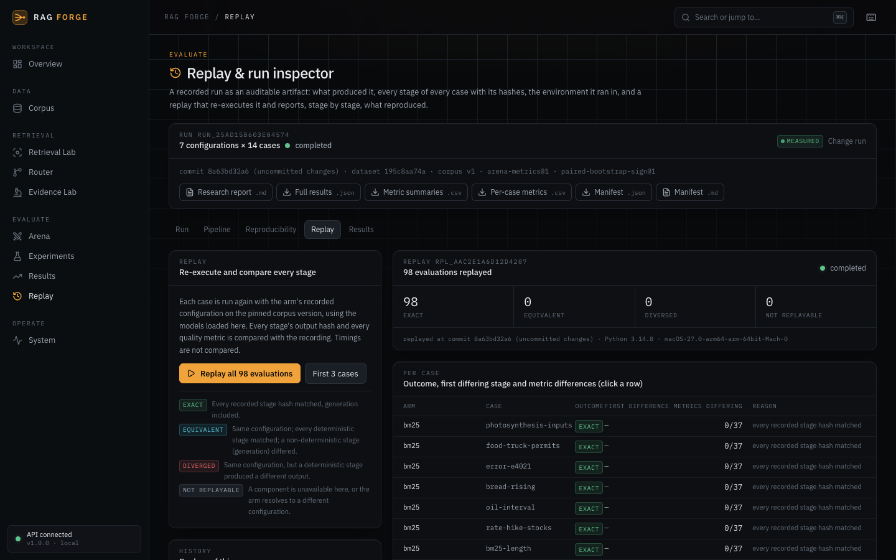 **Replay**: 98 of 98 evaluations reproduced every stage hash, with exports of the report, results, CSVs and manifest. | 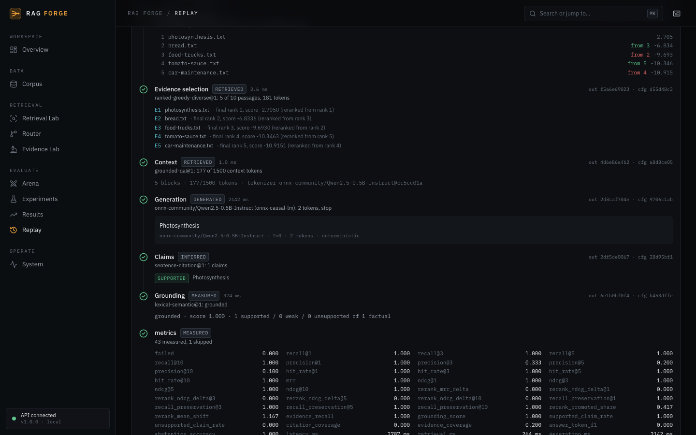 **Run inspector**: one case through one configuration, stage by stage, with output and configuration hashes. |
| 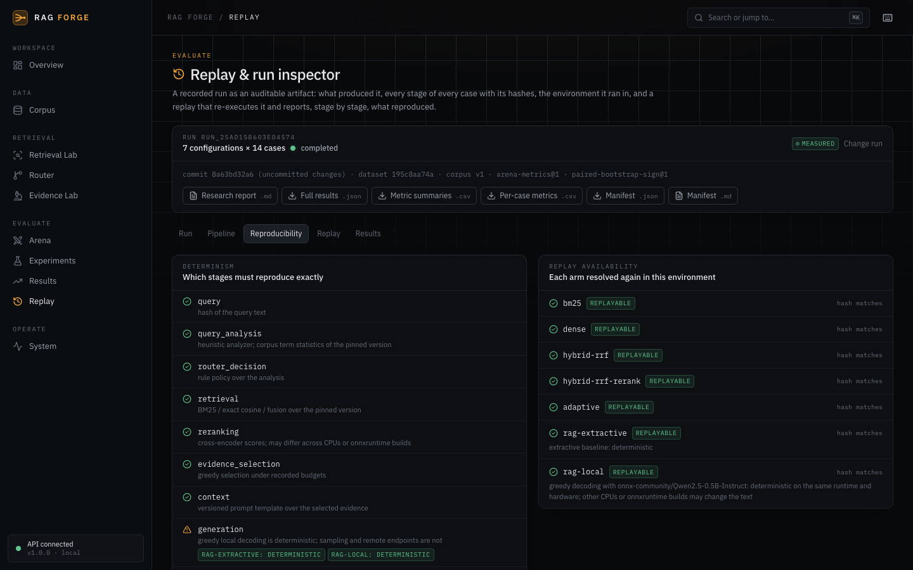 **Reproducibility**: which stages must reproduce, per-arm replay availability, model files with SHA-256. | 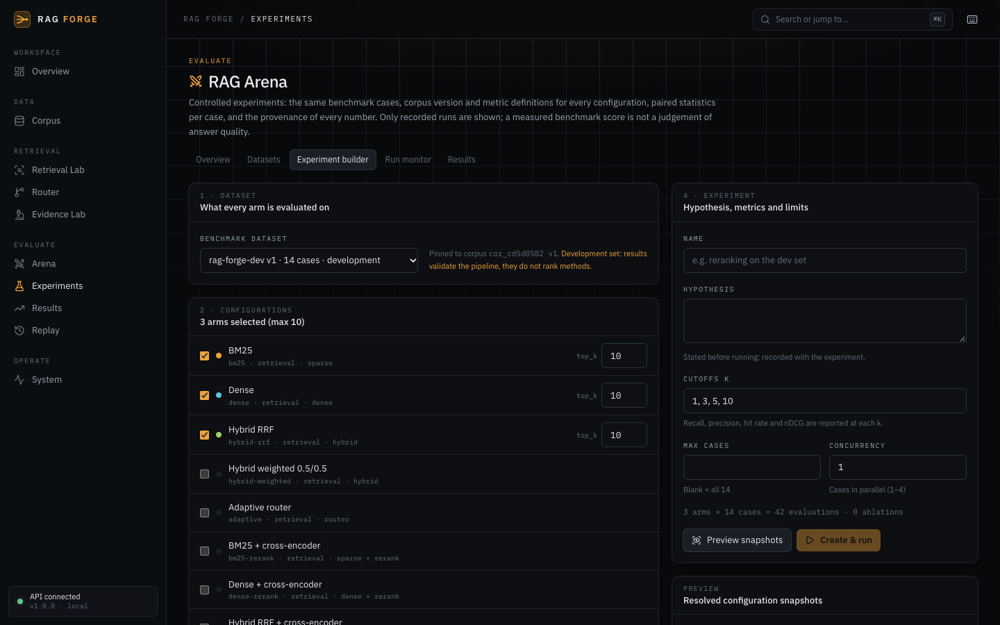 **Experiment builder**: dataset, configuration matrix, ablations, cutoffs and limits, with a snapshot preview before anything runs. |

## Architecture

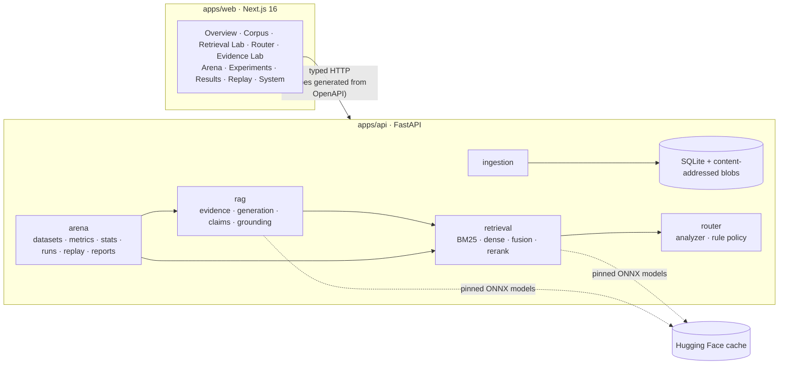

The web app knows the backend only through `packages/shared`, TypeScript generated from the API's
OpenAPI schema; CI fails if they drift. The Arena never reimplements a stage: it calls the same
retrieval and answer services the labs use. Details and the remaining diagrams (experiment
architecture, provenance chain): [docs/architecture](docs/architecture/README.md).

## The pipeline

```
INGEST → RETRIEVE → FUSE → RERANK → ANALYZE → ROUTE → EVIDENCE → GENERATE → GROUND → BENCHMARK → EXPERIMENT → REPLAY
```

| Stage | Implementation | Recorded |
|---|---|---|
| Ingest | Extract, chunk (`recursive` or `fixed`), version; duplicates by SHA-256 | Corpus version, chunking hash, per-file outcomes |
| Retrieve | BM25 (`k1`, `b`), exact cosine over a per-version dense index | Retrieval configuration hash, scores, matched terms |
| Fuse | Reciprocal rank fusion (k = 60) or weighted min-max | Per-component ranks, scores and contributions |
| Rerank | Cross-encoder over a candidate pool, final top-k | Upstream and final ranks, scores, movement statistics |
| Analyze | Features, lexical/semantic/complexity signals, labels, corpus coverage | Analysis hash, every contribution |
| Route | Rules choose BM25, dense, hybrid RRF or weighted, and reranking | Decision hash, rule trace, margin, alternatives |
| Evidence | Greedy, diverse selection under item, token and per-document budgets | Every candidate's outcome and reason |
| Generate | Local ONNX model, extractive baseline or HTTP endpoint; prompt `grounded-qa@1` | Prompt and answer hashes, tokens, determinism |
| Ground | Claims and citations checked by `lexical-semantic@1` | Support per claim, grounding score, citation metrics |
| Benchmark | Versioned datasets, metric registry `arena-metrics@1` | Dataset content hash, metric versions |
| Experiment | Snapshots, runs, ablations, `paired-bootstrap-sign@1` | Per-case results, traces, summaries, comparisons |
| Replay | Re-execute and compare every stage hash | Outcome and first differing stage per case |

## Research questions

| Question | Where |
|---|---|
| How does lexical retrieval compare with dense retrieval? | `bm25 → dense` ablation; Retrieval Lab comparison |
| When does hybrid retrieval help? | `bm25 → hybrid-rrf`, `hybrid-rrf → hybrid-weighted`; case explorer by tag |
| Does cross-encoder reranking improve ranking quality? | `hybrid-rrf → hybrid-rrf-rerank`; reranking metrics over the same pool |
| Can query characteristics drive retrieval selection? | `hybrid-rrf-rerank → adaptive`; router traces per case |
| How does retrieval quality affect grounding? | Grounded RAG arms; evidence and grounding metrics beside retrieval metrics |
| What is the latency/quality trade-off? | Stage latencies, tokens and failure rate beside quality, paired |
| How reproducible are RAG experiments? | Replay and manifests |

See [docs/research/summary.md](docs/research/summary.md) for how each is studied and what the
current data can and cannot show.

## Metrics and statistics

Every metric declares its family, version, required annotations and outputs, cutoff, unit,
aggregation and direction. **A metric whose annotations are missing is skipped with a reason,
never scored 0.** Grounding metrics measure support by the passages the generator saw, not truth;
token F1 and abstention accuracy are automatic proxies; no metric judges answer quality.

Comparisons pair the cases both configurations evaluated: seeded percentile bootstrap CIs (95%,
5000 resamples), effect size dz, wins/losses/ties by metric direction, an exact sign test with Holm
adjustment. No conclusion is drawn from fewer than 10 pairs, and a conclusion describes the dataset
only. Comparisons across different dataset content, corpus versions or metric definitions are
refused. Details: [metrics](docs/experiments/metrics.md), [statistics](docs/experiments/statistics.md).

## Reproducibility

Every run records the git commit (and whether the tree had uncommitted changes), Python, Node and
uv versions, lockfile hashes, runtime packages, settings with secrets redacted, every model file
with its SHA-256, configuration hashes per arm, dataset and corpus versions, seeds, and the metric
and statistics versions. Every case stores its full trace, content-addressed.

**Replay** re-executes recorded cases with the recorded configuration and compares the output hash
of each stage, from query analysis to grounding:

- `exact`: every stage reproduced, generation included;
- `equivalent`: every deterministic stage reproduced; a non-deterministic stage (sampling, a remote
  endpoint) differed;
- `diverged`: a deterministic stage differed;
- `not_replayable`: a component is unavailable, or the configuration now resolves differently.

Greedy local generation is reported as deterministic on the same runtime; remote endpoints never
are. Exports: Markdown research report, JSON bundle, metric and per-case CSVs, and a manifest in
JSON and Markdown. Details: [reproducibility](docs/reproducibility/README.md),
[replay](docs/reproducibility/replay.md).

## Example measured results

> **This is a development benchmark.** Twelve purpose-written documents and fourteen cases. It is
> small and saturated, so it validates the pipeline; it is **not** evidence that any method is
> better than another.

Run `run_25ad15b603e04574`: seven configurations × 14 cases = 98 evaluations, 0 failed, recorded
on an Apple Silicon laptop (CPU) with RAG FORGE 1.0.0 before the release commit.

| Configuration | nDCG@10 | MRR | Grounding score | Abstention acc. | Mean latency |
|---|---|---|---|---|---|
| BM25 | 0.972 | 0.962 | — | — | 10.0 ms |
| Dense | 0.994 | 1.000 | — | — | 33.5 ms |
| Hybrid RRF | 1.000 | 1.000 | — | — | 35.7 ms |
| Hybrid RRF + cross-encoder | 1.000 | 1.000 | — | — | 248 ms |
| Adaptive router | 1.000 | 1.000 | — | — | 223 ms |
| Grounded RAG, extractive baseline | 1.000 | 1.000 | 1.000 | 1.000 | 499 ms |
| Grounded RAG, Qwen2.5-0.5B local | 1.000 | 1.000 | 0.750 (4 cases) | 0.643 | 5089 ms |

What the paired statistics support on this dataset: no detectable retrieval-quality difference in
any declared pair (the set is at its ceiling); reranking adds about 212 ms per query; the local
0.5B model abstains wrongly more often than the extractive baseline (−0.357, 95% CI
[−0.643, −0.143]). Replaying the run reproduced all 98 evaluations exactly on the recording machine.
Full numbers and caveats: [docs/research/summary.md](docs/research/summary.md).

## Limitations

- The bundled benchmark cannot rank methods; there is no importer for public benchmarks.
- No human or LLM-as-judge evaluation of answer quality.
- The router is a hand-written heuristic baseline, not a trained policy, and is not shown to beat
  fixed pipelines.
- The default generator is a 0.5B CPU model; its answers are often short and it cites sparsely.
- The grounding verifier cannot detect contradiction.
- Exact dense search in memory; no metadata, graph or multi-hop retrieval.
- Replay exactness was measured on one machine, not across hardware.
- Single-user and local: no authentication.

All of them: [docs/limitations.md](docs/limitations.md).

## Project structure

```
rag-forge/
├── apps/
│   ├── api/                      FastAPI + Pydantic v2 (Python ≥ 3.12, uv)
│   │   ├── src/rag_forge/
│   │   │   ├── domain/           models shared by every layer (no I/O)
│   │   │   ├── ingestion/        extraction, chunking, versioning
│   │   │   ├── retrieval/        BM25, embeddings, dense index, fusion, hybrid, reranking
│   │   │   ├── router/           query analyzer, rule policy, adaptive router
│   │   │   ├── rag/              evidence, context, prompt, generators, claims, grounding
│   │   │   ├── arena/            datasets, metrics, statistics, snapshots, engine, replay, reports
│   │   │   ├── evaluation/       retrieval metric functions
│   │   │   ├── provenance/       environment, runtime and model file capture
│   │   │   ├── storage/          SQLite (migrations), lexical and vector indexes, blobs
│   │   │   └── api/              HTTP routes
│   │   └── tests/                pytest, real models, no mocked engine
│   └── web/                      Next.js 16, React 19, Tailwind v4
│       └── src/{app,features,components,lib}
├── packages/shared/              TypeScript API contracts generated from OpenAPI
├── docs/                         architecture, methodology, decisions, assets
├── scripts/gen-contracts.sh
├── data/  experiments/           local databases and outputs (git-ignored)
└── .github/workflows/ci.yml
```

## Quick start

Requires Node ≥ 20, npm and [uv](https://docs.astral.sh/uv/).

```bash
npm install
```

```bash
(cd apps/api && uv sync)
```

Start the API (http://localhost:8000, OpenAPI docs at `/docs`) and the web app
(http://localhost:3000) in two terminals:

```bash
npm run dev:api
```

```bash
npm run dev:web
```

Then open **Arena → Datasets → Install development benchmark** (creates the development corpus,
its dense index and dataset), build an experiment in **Experiments**, and inspect, replay and
export it in **Replay**. Models download once into `~/.cache/huggingface` on first use: the
embedder (~133 MB), the reranker (~90 MB) and the generator (~790 MB). No model weights are stored
in the repository.

## Development

```bash
npm run check
```

runs the web lint, typecheck, tests and production build.

```bash
cd apps/api && uv run ruff format --check src tests && uv run ruff check src tests && uv run mypy src tests && uv run pytest -q
```

runs backend formatting, lint, strict type checking and tests.

```bash
npm run contracts
```

regenerates `packages/shared` after an API schema change. CI ([workflow](.github/workflows/ci.yml))
runs all of these on every push: backend format, lint, strict mypy and pytest (with the real
models, cached by revision); API contract drift; frontend lint, typecheck, tests and build.

## Configuration

| Variable | Default | Effect |
|---|---|---|
| `RAG_FORGE_DATA_DIR` | `data` | SQLite database and blobs |
| `RAG_FORGE_CORS_ORIGINS` | `http://localhost:3000` | Allowed web origins |
| `RAG_FORGE_EMBEDDER` | pinned `bge-small-en-v1.5` | An `EmbedderSpec` as JSON |
| `RAG_FORGE_RERANKER` | pinned `ms-marco-MiniLM-L-6-v2` | A `RerankerSpec` as JSON |
| `RAG_FORGE_GENERATOR` | pinned `Qwen2.5-0.5B-Instruct` (4-bit ONNX) | A `GeneratorSpec` as JSON |
| `RAG_FORGE_OPENAI_BASE_URL`, `RAG_FORGE_OPENAI_MODEL`, `RAG_FORGE_OPENAI_API_KEY` | unset | Register an OpenAI-compatible `/chat/completions` endpoint as an extra generator; the key is never recorded |
| `NEXT_PUBLIC_API_URL` | `http://localhost:8000` | API the web app calls |

## API overview

All endpoints are under `/api/v1`; the full schema is at `/docs` on a running API.

| Area | Endpoints |
|---|---|
| System | `GET /health`, `GET /provenance/environment` |
| Corpus | `/corpora`, `/corpora/{id}/documents`, `/corpora/{id}/versions`, `/corpora/{id}/dense-index` |
| Retrieval and routing | `POST /corpora/{id}/retrieve` (manual or adaptive), `POST /router/decide` |
| Grounded generation | `POST /corpora/{id}/answer`, `GET /rag/components` |
| Arena | `/benchmarks`, `/experiments`, `/experiments/{id}/runs`, `/runs/{id}/{cases,leaderboard,compare}`, `/arena/*`, `/artifacts/{id}` |
| Reproducibility | `/runs/{id}/{replayability,replays,manifest,manifest.md,report.md,export.json,export/metrics.csv,export/cases.csv}`, `/replays/{id}` |

Missing components return `501`, unavailable models `503` and unfinished runs `409`; nothing
falls back silently.

## Documentation

[Documentation index](docs/README.md) ·
[Architecture](docs/architecture/README.md) ·
[Ingestion](docs/architecture/ingestion.md) ·
[Retrieval](docs/retrieval/README.md) ·
[Reranking](docs/retrieval/reranking.md) ·
[Routing](docs/routing/README.md) ·
[Evidence and grounding](docs/grounding/README.md) ·
[Generation](docs/grounding/generation.md) ·
[Arena](docs/experiments/README.md) ·
[Configuration](docs/experiments/configuration.md) ·
[Metrics](docs/experiments/metrics.md) ·
[Statistics](docs/experiments/statistics.md) ·
[Reproducibility](docs/reproducibility/README.md) ·
[Replay](docs/reproducibility/replay.md) ·
[Methodology](docs/research/methodology.md) ·
[Research summary](docs/research/summary.md) ·
[Limitations](docs/limitations.md) ·
[Decisions](docs/decisions/)

## Roadmap: complete

1. ✅ Ingestion and corpus versioning
2. ✅ Lexical retrieval (BM25)
3. ✅ Dense retrieval
4. ✅ Hybrid fusion (RRF, weighted)
5. ✅ Cross-encoder reranking
6. ✅ Query intelligence and adaptive routing
7. ✅ Evidence, grounding and generation
8. ✅ Arena: benchmarking and experiment engine
9. ✅ Replay, reproducibility and research presentation

RAG FORGE 1.0.0 is complete for this scope. Natural extensions (public benchmark importers, a
learned router, stronger verifiers) are listed in [docs/limitations.md](docs/limitations.md), not
promised.

## License

[MIT](LICENSE) © 2026 Soyeb Mohammad
