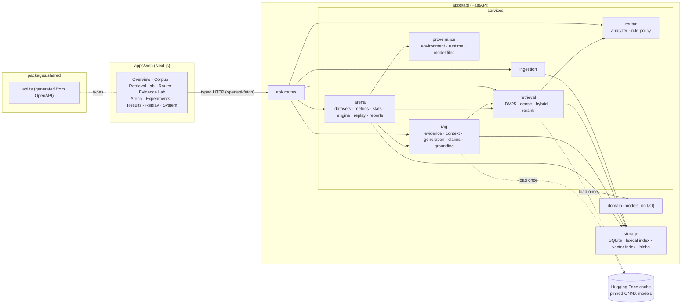
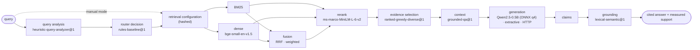

# Architecture

RAG FORGE is two applications and one generated contract:

- `apps/api`: FastAPI + Pydantic v2. Every model (corpora, retrieval, routing, evidence,
  generation, grounding, datasets, runs, replays) is a frozen Pydantic model that rejects unknown
  fields. SQLite and content-addressed blobs store everything; models run locally on CPU via
  onnxruntime.
- `apps/web`: Next.js 16, React 19, Tailwind v4. It never imports backend code.
- `packages/shared`: TypeScript types generated from the API's OpenAPI schema
  (`npm run contracts`). CI regenerates them and fails on any drift.

## A. System architecture

Dependency direction: `api → services → domain`. `domain` imports nothing from the project.
The Arena never reimplements a stage: it calls `RetrievalService.retrieve` and `RagService.answer`,
so a number in the Arena is the number the labs show for the same request.

## B. End-to-end pipeline

Each stage records its output hash, configuration hash, latency, origin (`retrieved`,
`inferred`, `generated`, `measured`) and whether it is deterministic. The chain is returned by
`POST /api/v1/corpora/{id}/answer`, stored with every Arena case, and compared stage by stage by
[replay](../reproducibility/replay.md).

## Backend packages

| Package | Responsibility | Docs |
|---|---|---|
| `domain` | Models shared by every layer; no I/O | — |
| `api` | HTTP schemas and routes; thin, delegates to services | [API overview](#api) |
| `ingestion` | Extraction (TXT, Markdown, PDF), chunking, versioning | [ingestion.md](ingestion.md) |
| `retrieval` | `Retriever` contract, BM25, embedder, dense index, fusion, hybrid, cross-encoder reranking | [retrieval](../retrieval/README.md), [reranking](../retrieval/reranking.md) |
| `router` | `QueryAnalyzer` + heuristic analyzer, `RouterPolicy` + rule baseline, `AdaptiveRouter` | [routing](../routing/README.md) |
| `rag` | Evidence selection, context, prompt contract, generators, claims, grounding verifier | [grounding](../grounding/README.md), [generation](../grounding/generation.md) |
| `arena` | Datasets, metric registry, statistics, snapshots, presets, experiment engine, replay, reports | [experiments](../experiments/README.md), [reproducibility](../reproducibility/README.md) |
| `evaluation` | Pure retrieval metric functions (shared by the Arena and `POST /evaluation/retrieval`) | [metrics](../experiments/metrics.md) |
| `provenance` | Environment and runtime capture, model file hashes | [reproducibility](../reproducibility/README.md) |
| `storage` | Store contract, SQLite + forward-only migrations (v5), lexical and vector indexes, blobs, Arena store | below |

## Storage

| Concern | Implementation |
|---|---|
| Corpora, documents, versions, chunks, ingestions | SQLite (`storage/sqlite.py`), append-only history enforced by triggers |
| Lexical index | SQLite inverted index, version-scoped BM25 statistics (`storage/lexical_index.py`) |
| Vectors | SQLite BLOBs keyed by (embedder hash, chunk), exact cosine search (`storage/vector_index.py`) |
| Document bytes, run traces | Content-addressed files `data/blobs/ab/abcd…` |
| Datasets, experiments, run cases, artifacts | SQLite, append-only (migration 4) |
| Runs, replays | SQLite rows updated only while they progress (migrations 4, 5) |

Migrations are forward-only (`MIGRATIONS[n]` upgrades n − 1 → n); a database newer than the code
is refused. The store contract allows Postgres; nothing assumes SQLite beyond `storage/`.

## Identity

- `RetrievalConfiguration.config_hash()`: a complete retrieval setup (corpus version, chunking,
  strategy, top-k, BM25, embedder, fusion, reranking, routing). In every retrieval response.
- `RagConfiguration.config_hash()`: retrieval plus evidence parameters, prompt template,
  generator, generation parameters and verifier. In every answer.
- `ConfigurationSnapshot.config_hash()`: an Arena arm, fully resolved, excluding its name.
- `BenchmarkDataset.content_hash`: corpus version plus cases.
- Artifacts and documents are addressed by the SHA-256 of their bytes.

## API

Grouped by area (full schema at `/docs` on a running API, or `packages/shared/openapi.json`):

| Area | Endpoints |
|---|---|
| System | `GET /health`, `GET /provenance/environment` |
| Corpus | `GET/POST /corpora`, `POST /corpora/{id}/documents`, versions, changes, documents, chunks, `GET/POST /corpora/{id}/dense-index` |
| Retrieval | `POST /corpora/{id}/retrieve` (manual or adaptive), `POST /router/decide`, `POST /evaluation/retrieval` |
| Grounded generation | `POST /corpora/{id}/answer`, `GET /rag/components` |
| Arena | `/benchmarks`, `/arena/{overview,metrics,presets,configurations/resolve,compare}`, `/experiments`, `/runs/{id}/{cases,leaderboard,compare}`, `/artifacts/{id}` |
| Reproducibility | `/runs/{id}/{replayability,replays,manifest,manifest.md,report.md,export.json,export/metrics.csv,export/cases.csv}`, `/replays/{id}` |

All paths are under `/api/v1`. Missing components return `501` with a structured detail,
unavailable models `503`, unfinished runs `409`; nothing falls back silently.

## Frontend

- `app/`: routes only (`/`, `/corpus`, `/corpus/[corpusId]`, `/retrieval`, `/router`,
  `/evidence`, `/arena`, `/experiments`, `/results`, `/replay`, `/system`).
- `features/<area>/`: screens. `components/ui/`: the design system. `components/shell/`:
  sidebar, command palette (⌘K), shortcuts.
- `lib/api.ts`: the typed client; `lib/use-api.ts`: fetch and polling hook.

Visual language: graphite surfaces, amber signal (`--color-signal`), cyan trace
(`--color-trace`) and a fixed colour per retrieval strategy (`--color-s-*`). Every data surface
states its origin (`OriginBadge`); nothing in the UI is sample data.
