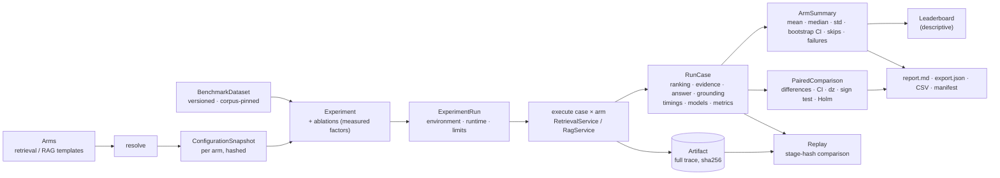

# RAG Arena: benchmarking and experiments

Code: `apps/api/src/rag_forge/arena/` (`datasets.py`, `metrics.py`, `stats.py`, `config.py`,
`presets.py`, `engine.py`), models in `domain/arena.py`, persistence in `storage/arena.py`
(migrations 4-5 in `storage/sqlite.py`), HTTP in `api/arena.py`. UI: `apps/web/src/features/arena/`
(`/arena`, `/experiments`, `/results`) and `features/replay/` (`/replay`).

## C. Experiment architecture

The Arena reuses the engine unchanged: retrieval arms call `RetrievalService.retrieve`, RAG arms
call `RagService.answer`, with the same models the API already holds in memory. Nothing in the
Arena reimplements retrieval, generation or grounding, so a number in the Arena is the number
the Retrieval Lab or Evidence Lab would show for the same request.

## Datasets

A `BenchmarkDataset` is an immutable version pinned to one corpus version (and its chunking
hash). Every annotation on a `BenchmarkCase` is optional:

| Field | Meaning | Used by |
|---|---|---|
| `query` | The question | every arm |
| `relevant_documents` | filename → graded relevance (> 0 relevant, 0 judged non-relevant) | retrieval and reranking metrics |
| `relevant_chunks` | chunk id → grade; takes precedence over documents when present | retrieval and reranking metrics |
| `reference_answer` | A short reference span | `answer_token_f1` |
| `answerable` | `false`: the corpus cannot answer it; `null`: not judged | `abstention_accuracy` |
| `expected_evidence` | filenames the selected evidence should include | `evidence_recall` |
| `tags`, `metadata` | Free stratification labels | display, filtering |

Registration (`POST /api/v1/benchmarks`) checks every judged filename and chunk id against the
pinned corpus version and returns the full list of problems (422) instead of the first.
Identical content (same corpus version, same cases) returns the existing version; changed
content under the same name creates version + 1. `content_hash` identifies the content.

Sources: `development` (bundled), `user` (registered through the API), `external` (reserved for
imported public benchmarks; there is no importer yet).

### The development benchmark

`POST /api/v1/benchmarks/development` creates a 12-document corpus written for the purpose
(photosynthesis, food-truck permits, bread, car maintenance, interest rates, BM25, dense
retrieval, RRF, cross-encoders, tomato sauce, error codes, Vesuvius), builds its dense index and
registers 14 cases: lexical, semantic/paraphrase, identifier, numeric, explanatory, a two-document
comparison (no reference answer), and one unanswerable question. Relevance holds by
construction (each document was written to answer its query); reference answers are spans
copied from the relevant document. The annotation notes say so on the dataset itself.

**It validates the pipeline. It does not rank methods.** It is small and easy: in local runs
every retrieval arm reaches nDCG@10 ≥ 0.97, so differences are mostly ceiling effects. Every
comparison on it carries a warning saying exactly this.

## Configurations, metrics and statistics

- [Experiment configuration](configuration.md): arms, snapshots, presets and ablations.
- [Metrics](metrics.md): the registry, requirements and skip semantics.
- [Statistical methodology](statistics.md): summaries, paired comparisons and conclusions.

## Runs

`POST /api/v1/experiments/{id}/runs` queues a run (202) and executes it in the background:

- the first `limits.max_cases` cases (default: all), every arm, `limits.concurrency` (1–4) cases
  in parallel, the loaded models reused throughout;
- one `RunCase` per case × arm: status, ranking with relevance grades and upstream ranks, route
  (adaptive), selected evidence, answer status and text, grounding counts, timings, tokens, model
  identities, a full trace artifact (content-addressed blob) and its metrics;
- a case that raises is stored as `failed` with its error type and message; the run continues;
- progress is persisted after each case; final status is `completed` (no failures), `partial`
  (some failures, all recorded) or `failed` (the run itself could not proceed).

Each run records dataset hash, corpus version, case ids, arms, snapshot hashes, limits, the
metric registry version, the statistics method, an `EnvironmentSnapshot` and a `RuntimeSnapshot`
(commit, toolchain, lockfiles, settings with secrets redacted, model files with hashes). See
[reproducibility](../reproducibility/README.md).

## Provenance: what produced this number?

Every aggregate is a mean over `RunCase.metrics`. Each `RunCase` names its run, arm, case,
configuration snapshot hash and retrieval configuration hash; `GET /api/v1/artifacts/{id}`
returns the full `RagResponse` or `RetrievalResponse` it came from. The snapshot pins the dataset
version, corpus version, models and parameters; the run pins the metric registry, statistics
method and environment.

## API

| Method | Path | Purpose |
|---|---|---|
| GET | `/api/v1/arena/overview` | Datasets, experiment count, recent runs, registry and statistics method |
| GET | `/api/v1/arena/metrics` | Metric definitions |
| GET | `/api/v1/arena/presets` | Arm templates, suggested ablations, default metric settings |
| GET, POST | `/api/v1/benchmarks` | List / register datasets |
| POST | `/api/v1/benchmarks/development` | Install the development benchmark (idempotent) |
| GET | `/api/v1/benchmarks/{id}` | A dataset version with its cases |
| POST | `/api/v1/arena/configurations/resolve` | Snapshots, hashes and diffs for a candidate matrix, without creating anything |
| GET, POST | `/api/v1/experiments` | List / create experiments |
| GET | `/api/v1/experiments/{id}` | Experiment with snapshots and ablations |
| GET, POST | `/api/v1/experiments/{id}/runs` | List runs / queue a run |
| GET | `/api/v1/runs`, `/api/v1/runs/{id}` | Run digests / one run with summaries |
| GET | `/api/v1/runs/{id}/cases[?arm=&status=]` | Per-case results, failures included |
| GET | `/api/v1/runs/{id}/cases/{case_id}` | One case across every arm |
| GET | `/api/v1/runs/{id}/leaderboard?metric=` | Descriptive ordering |
| GET | `/api/v1/runs/{id}/compare?baseline=&variant=` | Paired comparison within a run |
| GET | `/api/v1/arena/compare` | Paired comparison across runs |
| GET | `/api/v1/artifacts/{id}` | The full trace behind one case of one arm, with its stage chain |

Replay, manifests and exports (`/runs/{id}/replays`, `/manifest`, `/report.md`, `/export.json`,
`/export/*.csv`) are described in [reproducibility](../reproducibility/README.md) and
[replay](../reproducibility/replay.md).

The retrieval, router and answer endpoints are unchanged. The earlier placeholder
`GET/POST /api/v1/experiments` and `GET /api/v1/runs` (storage-only records around a
`RAGConfiguration`, never executed) are replaced by the routes above, and the placeholder
`RAGConfiguration`, `Experiment`, `ExperimentRun`, `EvaluationResult` and `Artifact` domain
models by their Arena counterparts.

## UI

`/arena` (also `/experiments` opening the builder and `/results` opening results):

- **Overview**: method, recent runs, registry and statistics method.
- **Datasets**: versions, sources, annotation coverage, cases with their ground truth.
- **Experiment builder**: dataset, arms (with top-k), suggested and custom ablations, ks, case
  limit, concurrency; preview of snapshots, hashes and differing factors before creating.
- **Run monitor**: live progress and failures.
- **Results**: metric cards, leaderboard with interval plot, statistical comparison (changes,
  per-metric paired statistics, per-case difference plot), case explorer (case × arm grid, then
  annotations, rankings with relevance and rank movement, evidence, answers, grounding, metrics,
  skips, timings and the trace link for two arms side by side), failures and skip reasons,
  latency distributions (p50/p95 by stage), configuration snapshots and ablation factors.

`/replay` inspects a finished run as an audit trail: run metadata and environment, every stage of
any case × arm with its hashes, determinism and replay availability, models with file hashes, the
replay history with per-case outcomes, the results views, and the exports.

Every chart draws recorded values only; empty states say nothing has been measured.

## Limits and what is not here

- Runs execute in-process (FastAPI background tasks, a small thread pool). A restart interrupts a
  running run; it stays `running` and is not resumed.
- Latency includes first-use model loading on the first case and is machine-specific.
- The development benchmark is too small and too easy to rank methods; there is no importer for
  public benchmarks yet (`external` is reserved).
- No LLM-as-judge, no human evaluation interface, no cost model.

See [known limitations](../limitations.md) for the whole platform.
