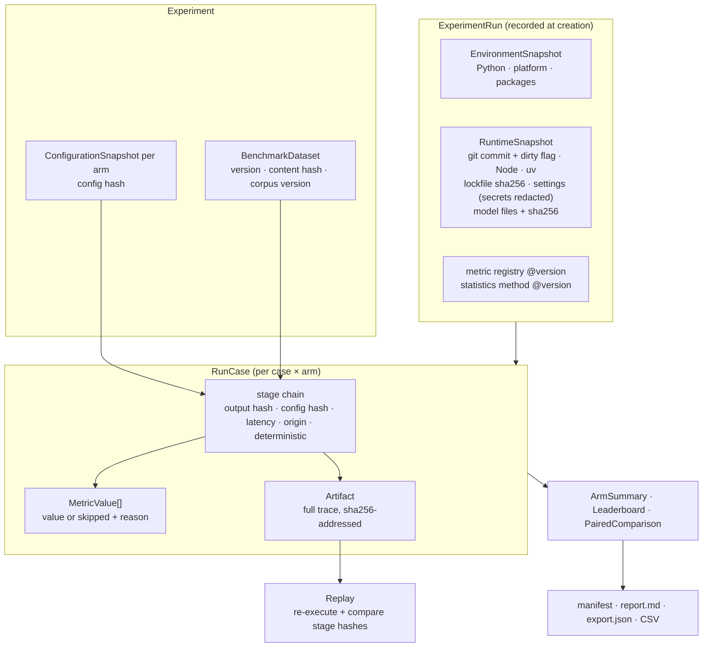

# Reproducibility

Code: `apps/api/src/rag_forge/provenance/` (environment and runtime capture),
`arena/reports.py` (manifest and exports), `arena/replay.py` ([replay](replay.md)).
UI: `/replay` (Run inspector: Run, Pipeline, Reproducibility, Replay, Results).

A measured number in RAG FORGE can be traced to what produced it, and a recorded run can be
re-executed and compared stage by stage. This page describes what is recorded; [replay.md](replay.md)
describes how it is checked.

## D. Provenance chain

## What a run records

| Item | Where | Notes |
|---|---|---|
| Git commit, uncommitted changes | `run.runtime.git_commit`, `git_dirty` | Read at run creation (not cached per process) |
| RAG FORGE, Python, platform, packages | `run.environment`, `run.runtime.packages` | onnxruntime, tokenizers, numpy, huggingface-hub, FastAPI, Pydantic, … |
| Node and uv versions | `run.runtime` | `null` when not on PATH |
| Lockfiles | `run.runtime.lockfiles` | SHA-256 of `apps/api/uv.lock` and `package-lock.json` |
| Settings | `run.runtime.settings` | `RAG_FORGE_*` and `HF_*`; names containing KEY, TOKEN, SECRET, PASSWORD or CREDENTIAL are recorded as `<redacted>` |
| Models | `run.runtime.models` | Role, provider, model, revision, config hash and every file with its SHA-256 (the Hugging Face LFS blob id, or computed for small files). Nothing is downloaded to compute them |
| Dataset and corpus | snapshots, run | Dataset id, version, content hash; corpus id, version, chunking hash |
| Configuration | `experiment.snapshots`, `run.snapshot_hashes` | Every arm resolved and hashed |
| Seeds | snapshots, statistics | Generation seed and temperature per RAG arm; bootstrap seed 20261007 |
| Metric and statistics versions | `run.metric_registry_version`, `run.stats_method` | `arena-metrics@1`, `paired-bootstrap-sign@1` |
| Traces | `arena_artifacts` + blobs | One full trace per case × arm, SHA-256 addressed |

Runs recorded before runtime capture existed have `runtime: null`; the manifest says so.

## Determinism

| Stage | Deterministic | Why |
|---|---|---|
| query, query analysis, router decision | yes | Pure functions of the text and the pinned corpus version's term statistics |
| retrieval (BM25, dense, fusion) | yes | Exact search over a pinned version (no approximate index) |
| reranking | yes | Same model, same inputs; floating point may differ across CPUs or onnxruntime builds |
| evidence selection, context | yes | Greedy selection under recorded budgets; versioned prompt template |
| generation | greedy local: yes; sampling or HTTP endpoint: no | Recorded per answer (`GenerationRecord.deterministic`) |
| claims, grounding | yes, given the generated text | Rule-based extraction, fixed verifier thresholds |
| statistics | yes | Seeded bootstrap |

Latency is never treated as reproducible.

## Manifest

`GET /api/v1/runs/{id}/manifest` returns a `ReproducibilityManifest` (`rag-forge-manifest@1`):
the run, dataset, every arm's hashes (configuration, retrieval or routing, evidence parameters,
prompt template, generator, verifier), the distinct context hashes recorded per arm, whether
generation was deterministic, models with file hashes, seeds, metric and statistics versions, the
recorded environment and runtime, the current environment with a list of differences, every
artifact with its SHA-256, and the run's replays. `GET …/manifest.md` renders it for people.

The manifest never contains secrets (tested with a key present in the environment).

## Exports

| Endpoint | Format | Content |
|---|---|---|
| `GET /runs/{id}/report.md` | Markdown | Research report: hypothesis, dataset, configurations and hashes, metrics by family with CIs, latency and failures, every paired comparison, per-case results, skips, interpretation, limitations, reproducibility |
| `GET /runs/{id}/export.json` | JSON (`rag-forge-export@1`) | Experiment, run, dataset with cases, every `RunCase`, comparisons, manifest |
| `GET /runs/{id}/export/metrics.csv` | CSV | One row per arm × metric: n, skipped, mean, median, std, min, max, CI |
| `GET /runs/{id}/export/cases.csv` | CSV | One row per case × arm × metric (long format); skipped values are empty with the reason, never 0 |

The report separates **measured** sections, **automatic proxy** metrics (token F1, abstention
accuracy) and **interpretation**. The interpretation only restates the recorded conclusions of the
paired comparisons ("on this dataset, X has a higher mean …, 95% CI …"), and stays silent where the
statistics draw no conclusion. It generates no qualitative judgement; the section for one is left
to the researcher. Exports require a finished run (`409` otherwise).

## Reproducing a run elsewhere

1. Check out the recorded commit; `uv sync --locked` and `npm ci` reproduce the lockfiles
   (compare their hashes with the manifest).
2. Start the API with the recorded settings. Models download at their pinned revisions; compare
   file hashes with the manifest.
3. Recreate the corpus and dataset (the development benchmark is `POST /benchmarks/development`;
   its content hash must match), create the experiment from `export.json`'s arms, run it, and
   compare. Within one installation, [replay](replay.md) does the comparison automatically.

Cross-machine replay of a stored run (copying the database and blobs) works the same way, because
the store is a single SQLite file plus content-addressed blobs.
